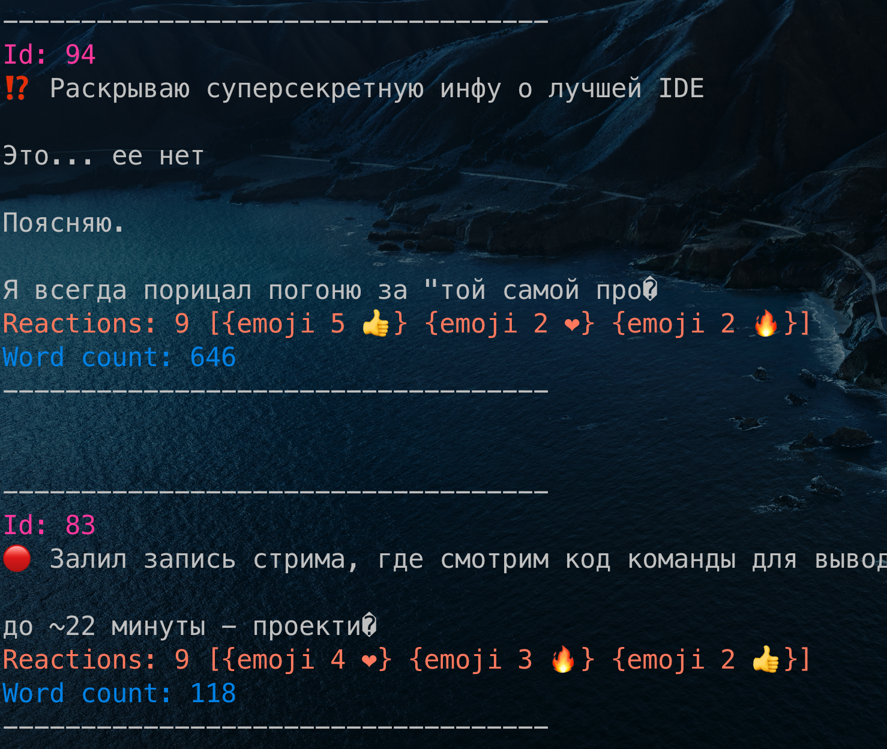

# Как использовать

1. Экспортировать посты из вашего тг канала в формате json
2. Положить экспортированный файл (result.json) рядом с бинарником tg-stats-mac или в корень проекта

# Команды
```shell

./binaries/tg-stats-mac -h # Доступный список комманд

./binaries/tg-stats-mac --popular # Вывести 5 самых популярных постов
./binaries/tg-stats-mac --popular --qty=10 # 10 самых популярных
./binaries/tg-stats-mac --unpopular --qty=3 # 3 самых непопулярных поста
./binaries/tg-stats-mac --longest # 5 самых длинных постов
./binaries/tg-stats-mac --shortest --qty=7 # 7 самых коротких постов

./binaries/tg-stats-mac --post-count # количество постов
./binaries/tg-stats-mac --post-count --min-word-count=150 # количество постов от 150 слов и больше (посты с меньшим количеством символов игнорируем) 
./binaries/tg-stats-mac --average-word-count # Среднее количество слов в постах
./binaries/tg-stats-mac --average-word-count --min-word-count=100 # Среднее количество слов в постах от 100 слов
```

