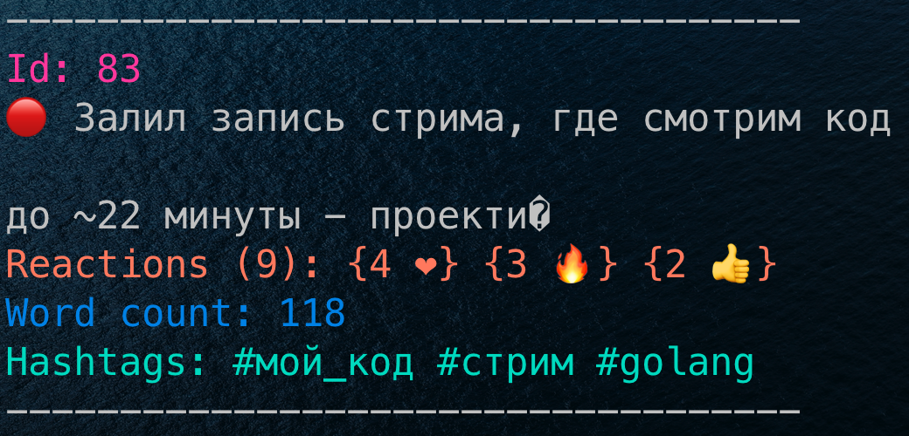

# Как использовать

Сначала экспортировать посты из вашего тг канала в формате json

Далее:

## Файл (Опция A)
Скачать из репозитория файл ./binaries/tg-stats-mac

Примечение: он работает только для мака. Если нужен такой файл для винды / линуска - можно написать мне и я его скомпилю.

- Положить экспортированный файл с постами (result.json) рядом с бинарником tg-stats-mac
- Запустить бинарник с нужной командой - полный их список ниже

## Репозиторий (Опция B)
Склонировать репозиторий и запустить прогу напрямую через go

result.json в таком случае нужно класть в корень проекта.

# Команды
```shell

./binaries/tg-stats-mac -h # Доступный список комманд

./binaries/tg-stats-mac --popular # Вывести 5 самых популярных постов
./binaries/tg-stats-mac --popular --single-reaction # Вывести 5 самых популярных постов на основании одной максимальной реакции (по умолчанию считается сумма всех реакций)
./binaries/tg-stats-mac --popular --qty=10 # 10 самых популярных постов
./binaries/tg-stats-mac --unpopular --qty=3 # 3 самых непопулярных поста
./binaries/tg-stats-mac --longest # 5 самых длинных постов
./binaries/tg-stats-mac --shortest --qty=7 # 7 самых коротких постов

./binaries/tg-stats-mac --hashtags # Вывести список всех хэштегов из постов 
./binaries/tg-stats-mac --hashtags-popular # Вывести топ 5 популярных хэштегов
./binaries/tg-stats-mac --hashtags-popular --qty=10 # Вывести топ 10 популярных хэштегов
./binaries/tg-stats-mac --hashtags-popular --qty=7 # Вывести топ 7 популярных хэштегов на основании одной максимальной реакции
./binaries/tg-stats-mac --hashtags-unpopular # Вывести топ 5 непопулярных хэштегов

./binaries/tg-stats-mac --post-count # количество постов
./binaries/tg-stats-mac --post-count --min-word-count=150 # количество постов от 150 слов и больше 
./binaries/tg-stats-mac --average-word-count # Среднее количество слов в постах
./binaries/tg-stats-mac --average-word-count --min-word-count=100 # Среднее количество слов в постах от 100 слов
```

